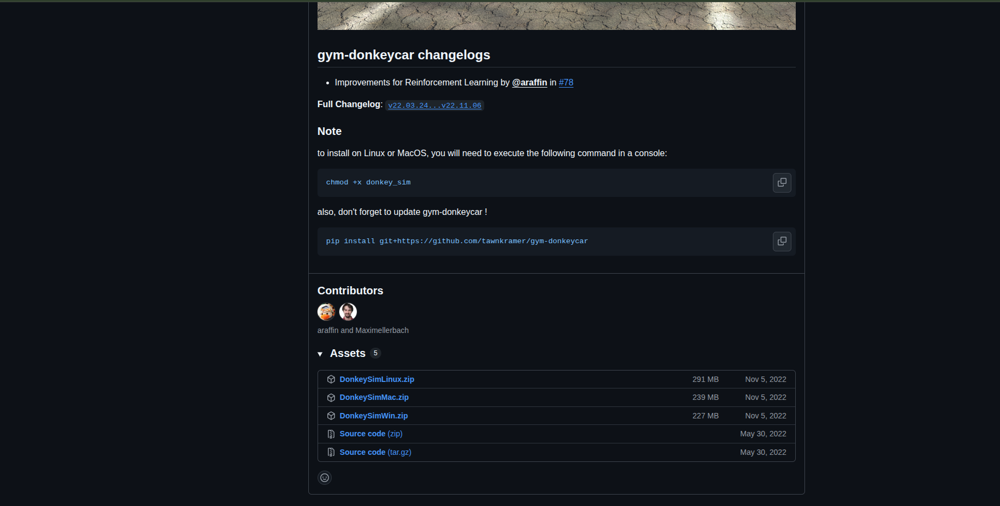
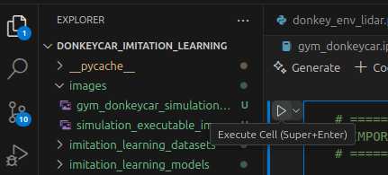

# <p style="text-align: center;"> How to Install All Required Dependencies</p>

The first thing to do is to make sure that you have **VSCode** installed, whose installation instructions can be found here: https://code.visualstudio.com/Download 


Then, you need to make sure that you have installed **Miniconda**, whose download can be found here: https://www.anaconda.com/docs/getting-started/miniconda/install. **Miniconda** allows us to manage python packages in an isolated way, so that we basically ignore package dependencies. 

Once **Miniconda** is installed, please run the following command in this repository:


```sh
conda env create -f donkey.yml -y
```

This command will create a new donkey virtual environment, which will contain all of the python libraries necessary to run the donkeycar simulator.

**Note**: Please remember that before you start running anything or working on this codebase, you have to run:

```sh
conda activate donkey
```

This command will ensure that all of the dependencies required for running everything are loaded properly. If you don't run this command and don't see "(donkey)" on the left side of your terminal, then you should ensure that you run the above command.


The final step to install everything you need to start racing is to download the simulation executable. To download the simulation executable, please find the latest version of the zip file here: https://github.com/tawnkramer/gym-donkeycar/releases.

Scroll down to the point where you see these download files, and click on the download file that corresponds to your operating system.



Once you have downloaded the file, please put the file somewhere on your computer, and then save the path to the file. For example, if you are on Windows, and you save the file to your "Documents" folder, then it would be C:\Users\<PUT YOUR USERNAME HERE>\Documents\DonkeySimWin.zip for instance. Take this path, and then open the gym_donkeycar.ipynb file in VSCode and edit the value of the "PATH_TO_SIMULATOR_EXECUTABLE" variable.


Once you have edited this variable, then everything should work properly! To run everything, now, all you have to do is press the run button on each cell to run each part of the code and go through the imitation learning!




## <p style="text-align: center;"> Extra Resources and Libraries Used</p>

The primary libraries used in this codebase are:

- The imitation learning dataset and stablebaselines3 to actual learn how to drive well through imitation learning and actor critic policy improvement. Here are some helpful links: https://imitation.readthedocs.io/en/stable/_api/imitation.algorithms.bc.html?highlight=save_policy, https://stable-baselines3.readthedocs.io/en/master/
- Farama Foundation Gymnasium (which is pretty much the same as OpenAI Gym), and this gives us an easy way to interact with reinforcement learning environments. For more information see the following link: https://gymnasium.farama.org/ 
- Pynput for registering keyboard inputs from the user for human demonstration data: https://pynput.readthedocs.io/en/latest/keyboard.html
