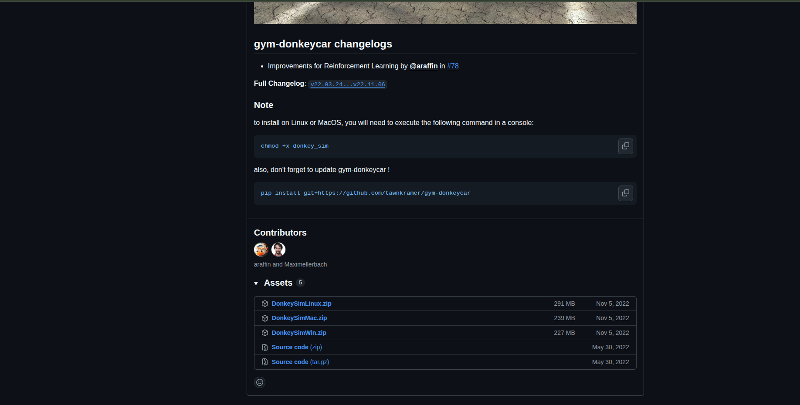
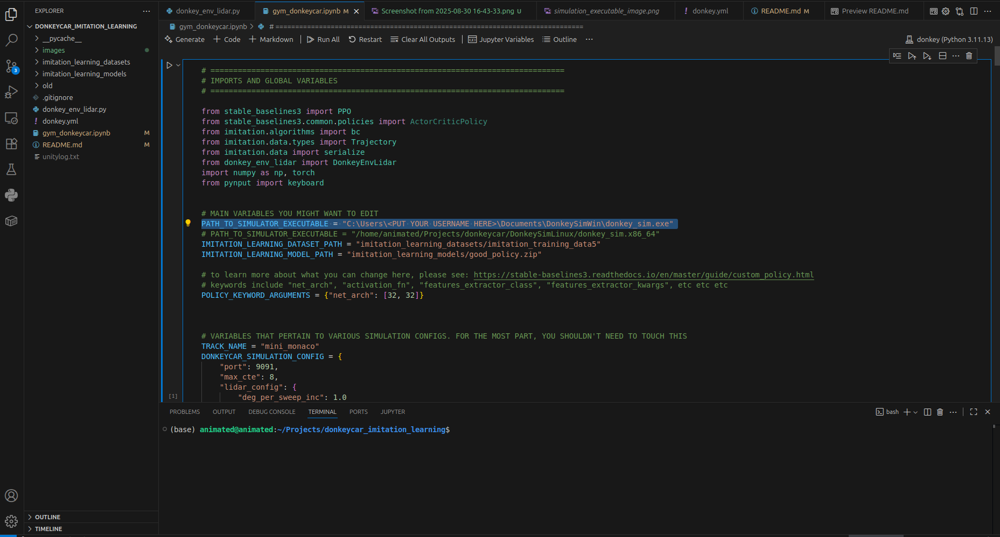
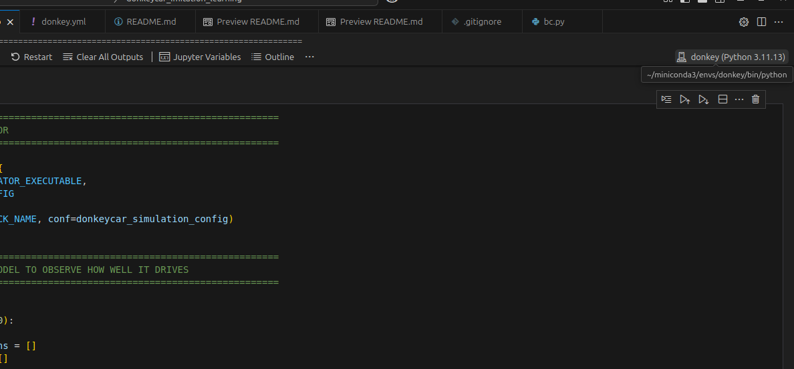
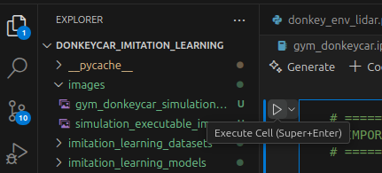

# <p style="text-align: center;"> How to Install All Required Dependencies</p>

The first thing to do is to make sure that you have **VSCode** installed, whose installation instructions can be found here: https://code.visualstudio.com/Download 


Then, you need to make sure that you have installed **Miniconda**, whose download can be found here: https://www.anaconda.com/docs/getting-started/miniconda/install. **Miniconda** allows us to manage python packages in an isolated way, so that we basically ignore package dependencies. 

Once **Miniconda** is installed, please run the following the following commands in a terminal:

```sh
git clone https://github.com/AI-VT/donkeycar_imitation_learning
```

```sh
cd donkeycar_imitation_learning
```

```sh
conda env create -f donkey.yml -y
```

This command will create a new donkey virtual environment, which will contain all of the python libraries necessary to run the donkeycar simulator.

```sh
code .
```


The final step to install everything you need to start racing is to download the simulation executable. To download the simulation executable, please find the latest version of the zip file here: https://github.com/tawnkramer/gym-donkeycar/releases.

Scroll down to the point where you see these download files, and click on the download file that corresponds to your operating system.


From here, there are slightly different installation instructions depending on your operating system, so make sure to follow the installation instructions corresponding to your operating system


<br>
<br>

## Windows Installation

On Windows, once you have downloaded the corresponding zip file, please put the file somewhere on your computer, unzip it, and then save the path to the executable file. For example, if you save the file to your "Documents" folder, then it would be ```C:\Users\<PUT YOUR USERNAME HERE>\Documents\DonkeySimWin\donkey_sim.exe``` for instance. 

<br>

## Linux Installation

On Linux, once you have downloaded the corresponding zip file, please put the file somewhere on your computer, unzip it, and then save the path to the executable file. For example, if you save the file to your "Documents" folder, then it would be ```/home/<PUT YOUR USERNAME HERE>/Documents/DonkeySimLinux/donkey_sim.x86_64```. After you have the executable on your computer, make sure that has the proper permissions with the following command:

```sh
chmod +x /home/<PUT YOUR USERNAME HERE>/Documents/DonkeySimLinux/donkey_sim.x86_64
```

<br>

## MAC Installation

On MAC, once you have downloaded the corresponding zip file, please put the file somewhere on your computer, unzip it, and then save the path to the executable file. For example, if you save the file to your "Documents" folder, then it would be ```/Users/<PUT YOUR USERNAME HERE>/Documents/DonkeySimMac/donkey_sim.app/Contents/MacOS/donkey_sim```. After you have the executable on your computer, make sure that has the proper permissions with the following command:

```sh
chmod +x /Users/<PUT YOUR USERNAME HERE>/Documents/DonkeySimMac/donkey_sim.app/Contents/MacOS/donkey_sim
```

<br>
<br>

**Once you have the path to the donkey_sim executable, take this path, and then open the gym_donkeycar.ipynb file in VSCode and edit the value of the "PATH_TO_SIMULATOR_EXECUTABLE" variable.**



**Also, ensure that the widget on the top left of the gym_donkeycar.ipynb file says donkey. When you first start the file, it will say select kernel. Click on that and select the donkey environment.**



Once you have edited this variable and ensured that you are using the ```donkey``` conda environment on vscode, then everything should work properly! To run everything, now, all you have to do is press the run button on each cell to run each part of the code and go through the imitation learning!




## <p style="text-align: center;"> Extra Resources and Libraries Used</p>

The primary libraries used in this codebase are:

- The imitation learning dataset and stablebaselines3 to actual learn how to drive well through imitation learning and actor critic policy improvement. Here are some helpful links: https://imitation.readthedocs.io/en/stable/_api/imitation.algorithms.bc.html?highlight=save_policy, https://stable-baselines3.readthedocs.io/en/master/
- Farama Foundation Gymnasium (which is pretty much the same as OpenAI Gym), and this gives us an easy way to interact with reinforcement learning environments. For more information see the following link: https://gymnasium.farama.org/ 
- Pynput for registering keyboard inputs from the user for human demonstration data: https://pynput.readthedocs.io/en/latest/keyboard.html
